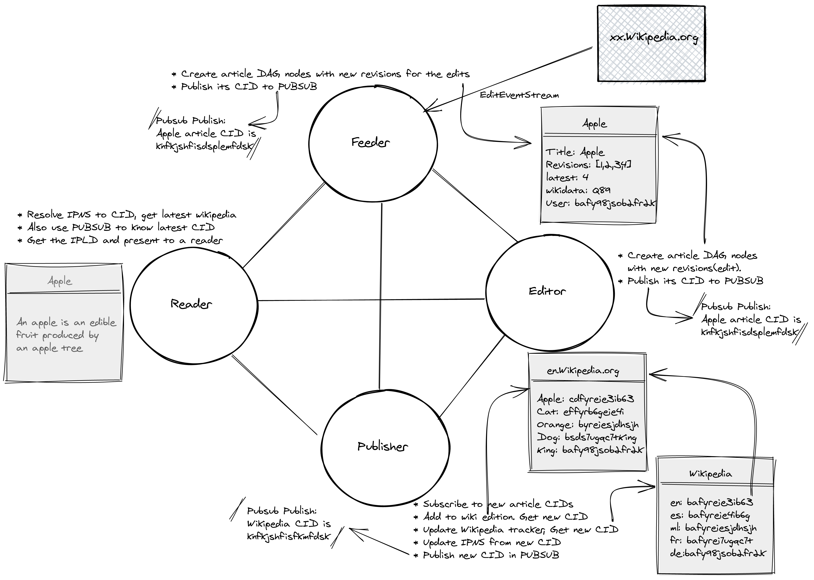
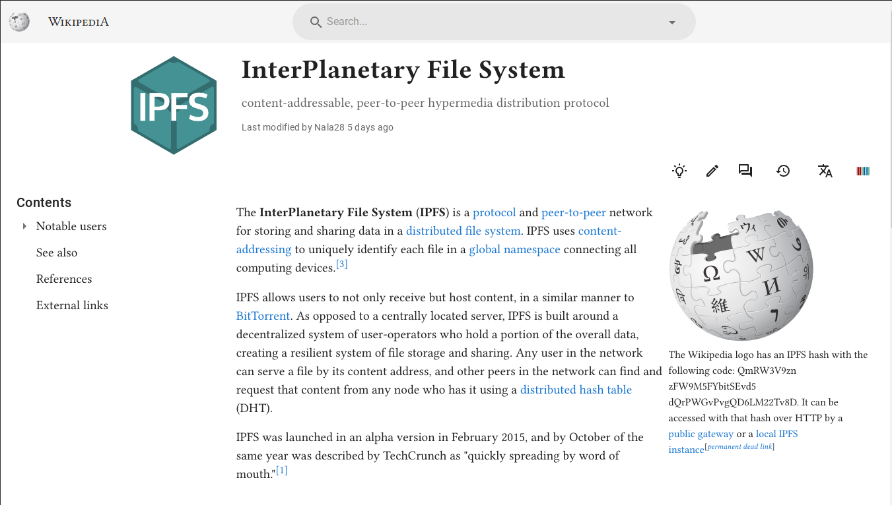
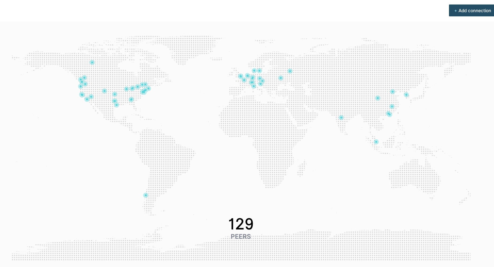

# Wikipedia-IPFS

An exploration to host Wikipedia in [IPFS][1]. This project contains code to extract content from wikipedia and add to IPFS and documentation of the proposed architecture. This is just a proof of concept and not ready for any serious use.

## Introduction

[IPFS][1] is a protocol for building decentralized web. Wikipedia is currently hosted in **its** servers. To decentralize the sum of all human knowledge, we need to host and maintain all such knowledge in a decentralized network. There are many candidates for such distributed web protocol. IPFS, [DAT][2] are some examples. None of them are highly popular among common internet users, but they are in more or less active development.

IPFS had [attempted][3] to host the Turkish wikipedia a few years back. It is based on static snapshot of wikipedia pages - basically static html files. If somebody update the hosted snapshot, users get that snapshot. But wikipedia is very dynamic. Thousands of edits happens every day. New articles are created every time. The pre-rendered HTML pages are not really a convenient representation of knowledge, at least it is not convenient for computing.

If you are not already familiar with the concepts of decentralized web and IPFS, please have some background reading about them to better understand this document.

## Goals

1. **Every Wikipedia content revisions as objects in decentralized web. They are content addressable**:  This is basic units of content in wikipedia world. Each revision, once created, is immutable. There is no way you can change it. Each revision will have content associated with it and some metadata such as who create it and when.
2. **Every wikipedia article having an object in decentralized web with pointers to its revisions**: An article in wikipedia is editable. The latest revision represent the current state of the article. But one can always access its  old revisions at any point. It is desirable to have a human readable name along with IPFS hash id for each article.
3. **Every wikipedia having an object in decentralized web with addresses of its articles**: A wikipedia is a collection of articles(But not limited to). So a wikipedia like English Wikipedia is kind of a registry with listing of all its articles. (*In case you are wondering why I mention each wikipedia when there is a single wikipedia - You may not know this, but there are wikipedia in nearly 300 languages. English Wikipedia, Spanish Wikipedia, Tamil Wikipedia are examples*)
4. **A Wikipedia reading web application that can live in a decentralized web**: To make the content in decentralized web usable or consumable, we need a wikipedia reading and possibly editing interface. This application presents the content for human conception.

# Architecture

In my previous attempt, I was trying to model everything using files and using "files" feature of IPFS. You may read that approach in README.old.md in this repo. After I published it, many people contacted and me to discuss these concepts. From all those discussions, I found that, it is better to model the content as Linked Data. It gives easier path towards semantic knowledge(a concept I am very much interested). So in this approach, I am using [IPLD][17] - Inter Planetory Linked Data.

## Feeder

TODO: Add documentation

See packages/feeder folder in repo

## Publisher

TODO: Add documentation

See packages/publisher folder in repo

## Editor

TODO: Add documentation

## Reader

In the past, I(Santhosh) had attempted to build a static web application that can be hosted in distributed web. I used dat protocol for this and you can see this application in normal web at [wikipedia.thottingal.in][7] and [wikipedia.hashbase.io][8] - a pinning service or directly from dat protocol `dat://aab37b6f74832891e5b2c593fac748df6379d81c0f2b781f713b0dde229a298d/` (this need [Beaker][4] browser).

I have placed this application in IPFS. See https://bafybeibgkplzawivq3w3evxj6uxy2e4uckgy3skyxicll7rxnrpuz6okn4.ipfs.dweb.link/

If you wonder why that does not look like IPFS URL, it is because this application as a Single Page Application with History mode routing, it need to be addressed from a domain or subdomain. So I used the dweb projects subdomain approach to access it. `bafybeibgkplzawivq3w3evxj6uxy2e4uckgy3skyxicll7rxnrpuz6okn4` is base32 encoded form of `QmQvGMPfub4HwD5BxuPQ95skHENw36wrkJisYMQWkgqdkJ`. Alteratively this application can be run from desktop or mobile(it is a Progressive web app). Anyway, some work is required in this front, but there is a proof of concept. It currently uses the wikipedia REST API and need to rewire to take content from decentralized web.

## Permanent address

If every edit change the CID or hash of wiki, how do we refer it in a permanent way? IPFS provides a way for this - It is name IPNS(Inter Planetory Naming System)

"Inter-Planetary Name System (IPNS) is a system for creating and updating mutable links to IPFS content. Since objects in IPFS are content-addressed, their address changes every time their content does. That’s useful for a variety of things, but it makes it hard to get the latest version of something. A name in IPNS is the hash of a public key. It is associated with a record containing information about the hash it links to that is signed by the corresponding private key. New records can be signed and published at any time."

So every wikipedia, in addition to its `ipfs/CID` address, there will be an IPNS address like `/ipns/QwxoosidSOKWms..`. If that is not readable [DNSLink][6] comes handy and we can have addresses like `/ipns/en.wikipedia.org`.

The requirement of having a private key and generation of IPNS based on that is helpful for enforcing some authenticity - that this article is indeed published in wikipedia and nobody else can copy, modify and publish an IPFS structure with this IPNS. They can indeed copy, modify and publish, but never can have IPNS owned by wikipedia.

## How to add Wikipedia content to IPFS

TODO: Add documentation

## Why IPFS and not other protocols

As you may have already noticed, I had experimented with DAT protocol as well. All of the decentralized web protocols are in its early stage. I noticed active development in DAT project last year, but it seems slow now. The requirement for [beaker browser][4] to access dat:// protocol and no support in main stream browsers continue as a main problem. IPFS is also not an exception. Native URLs in IPFS - ipfs:// - require browser extensions like [IPFS Companion][15], but at least that exist. I must say it is a very handy extension for working with IPFS. The availability of pinning or public gateways is another problem applicable for all protocols. Decentralized web is cheap and fast only when there are lot of active nodes. I think this issues are going to continue till some big use cases emerge and protocol becomes main stream. IPFS development is very active, but at the same time it seems it is [getting lost in the general direction][16] sometimes too.

However, the above architecture outlined above should not be drastically different for other protocols. The code idea of content addressable units of data remains same.

Below screenshot shows the poor number of peers I get from India.

## What next

Wikipedia is big. The concepts I explained in content architecture address only a subset of the content. There are users, non-article content. There are interactive(JS based) content. There are talk pages and so on. We need a content architecture to accommodate all of them. If we are able to map every REST API output of wikipedia to corresponding data source in IPFS, building a reading application is more close.

There are so many problems to solve: The content has links that need to be rewritten. The images need to be stored and addressed. I don't know how to implement a powerful search in IPFS content. More importantly, how to edit this content? resolve conflicts? They are not impossible anyway.

Wikipedia users share the sum of free knowledge. They create the content collaboratively and share it. Can they share the infrastructure also? If reading a wikipedia page means having a copy of the content in the node in a decentralized web, I think it will be faster and cheaper to run wikipedia.

## Note

Even though the author is an Engineer at Wikimedia foundation, this is not an official Wikimedia foundation project.

[1]: https://ipfs.io/
[2]: https://datproject.org
[3]: https://ipfs.io/blog/24-uncensorable-wikipedia/
[4]: https://beakerbrowser.com/
[5]: https://docs.ipfs.io/guides/concepts/ipns/
[6]: https://docs.ipfs.io/guides/concepts/dnslink/
[7]: https://wikipedia.thottingal.in
[8]: https://wikipedia.hashbase.io
[9]: https://wikitech.wikimedia.org/wiki/Event_Platform/EventStreams
[10]: https://js.ipfs.io/
[11]: https://github.com/ipfs/go-ipfs
[12]: https://docs-beta.ipfs.io/reference/http/api/#getting-started
[13]: https://github.com/ipfs/js-ipfs/tree/master/packages/ipfs-http-client
[14]: https://ml.wikipedia.org/wiki/രവി_വള്ളത്തോൾ
[15]: https://github.com/ipfs-shipyard/ipfs-companion
[16]: https://www.publish0x.com/ecosystem-overviews-and-analysis/the-precarious-state-of-ipfs-in-the-year-2020-xmvxeg
[17]: https://ipld.io/