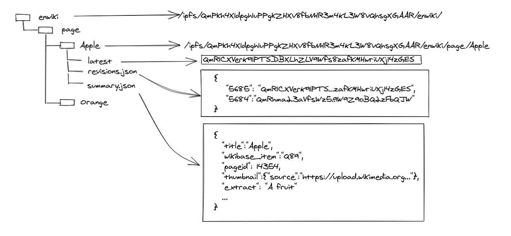
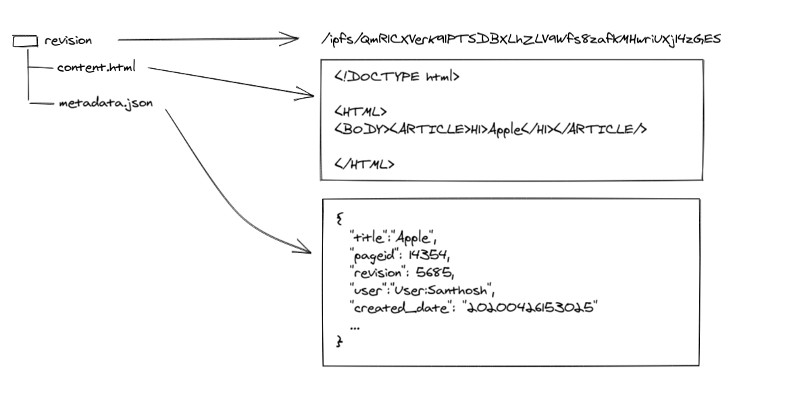
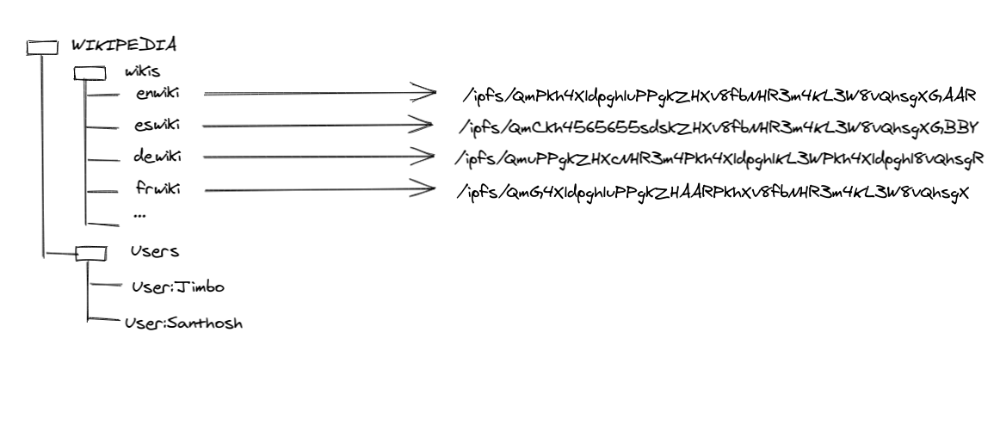

# Wikipedia-IPFS

An exploration to host Wikipedia in [IPFS][1]. This project contains code to extract content from wikipedia and add to IPFS and documentation of the proposed architecture. This is just a proof of concept and not ready for any serious use.

## Introduction

[IPFS][1] is a protocol for building decentralized web. Wikipedia is currently hosted in its servers. To decentralize the sum of all human knowledge, we need to host and maintain all such knowledge in a decentralized network. There are many candidates for such distributed web protocol. IPFS, [DAT][2] are some examples. None of them are highly popular among common internet users, but they are in more or less active development.

IPFS had [attempted][3] to host the Turkish wikipedia a few years back. It is based on static snapshot of wikipedia pages - basically static html files. If somebody update the hosted snapshot, users get that snapshot. But wikipedia is very dynamic. Thousands of edits happens every day. New articles are created every time. The pre-rendered HTML pages are not really a convenient representation of knowledge, at least it is not convenient for computing.

## Goals

### Every wikipedia content revisions as objects in decentralized web. They are content addressable.

This is basic units of content in wikipedia world. Each revision, once created, is immutable. There is no way you can change it. Each revision will have content associated with it and some metadata such as who create it and when.

### Every wikipedia article having an object in decentralized web with pointers to its revisions.

An article in wikipedia is editable. The latest revision represent the current state of the article. But one can always access its  old revisions at any point. It is desirable to have a human readable name along with IPFS hash id for each article.

### Every wikipedia(English Wikipedia, Spanish Wikipedia, Tamil Wikipedia) having an object in decentralized web with addresses of its articles.

A wikipedia is a collection of articles(But not limited to). So a wikipedia like English Wikipedia is kind of a registry with listing of all its articles.

### A Wikipedia reading web application that can live in a decentralized web.

To make the content in decentralized web usable or consumable, we need a wikipedia reading and possibly editing interface. This application presents the content for human conception.

# Architecture

Let us define how we will define an article about "Apple" in English wikipedia.

As illustrated a wiki is a directory with pages as subtitles. But page content is not in this directory. The directory **Apple** only has its metadata and list of revisions and pointer to latest revision. In this example, accessing an IPFS object with content id(CID)
`QmR1CXVerK91PTSDBXLhZLV9Wfs8zafkMHwriUXj14zGES` gives you the revision object with content.

Why not having each revisions and its content under `Apple` directory? As mentioned above, an article is mutable. It can be edited. A new revision can be added. When such changes happen, the content id(known as hash or CID) of its parent directory changes and this change causes CID of all its parents change. IPFS need to compute the CID of the whole directory `enwiki`. So this data in IPFS need to be designed as mutable file system(MFS). But revisions are immutable. Once a revision is created, it get a CID and thats it. No more change to that is allowed. It becomes a free floating data packet in decentralized network, addressable by its CID. It is relevant only when a registry tracks its address. An untracked revision CID is a deleted revision, it does not correspond to any article.

Let us look at what a revision contains:

You may wonder why an article like `Apple` cannot have an independent mutable IPFS object and wiki tracks it by address and not as a file under wiki directory. This is indeed possible, but I chose the idea of titles under wikipedia directory for fast discovery and search for articles by titles. Traversal of articles under a wiki will involve too many IPFS CID resolves in that case.

Finally we have the collection of wikipedia editions. We need to track this because that allows cross linking articles in different languages.

There are User accounts that are multi-wiki accounts. I think they should be represented similar to Articles. They are mutable objects.

## Permanent address

If every edit change the CID or hash of wiki, how do we refer it in a permanent way? IPFS provides a way for this - It is name IPNS(Inter Planetory Naming System)

"Inter-Planetary Name System (IPNS) is a system for creating and updating mutable links to IPFS content. Since objects in IPFS are content-addressed, their address changes every time their content does. That’s useful for a variety of things, but it makes it hard to get the latest version of something. A name in IPNS is the hash of a public key. It is associated with a record containing information about the hash it links to that is signed by the corresponding private key. New records can be signed and published at any time."

So every wikipedia, in addition to its `ipfs/CID` address, there will be an IPNS address like `/ipns/QwxoosidSOKWms..`. If that is not readable [DNSLink][6] comes handy and we can have addresses like `/ipns/en.wikipedia.org`.

The requirement of having a private key and generation of IPNS based on that is helpful for enforcing some authenticity - that this article is indeed published in wikipedia and nobody else can copy, modify and publish an IPFS structure with this IPNS. They can indeed copy, modify and publish, but never can have IPNS owned by wikipedia.

## The reading application

In the past, I(Santhosh) had attempted to build a static web application that can be hosted in distributed web. I used dat protocol for this and you can see this application in normal web at [wikipedia.thottingal.in][7] and [wikipedia.hashbase.io][8] - a pinning service or directly from dat protocol `dat://aab37b6f74832891e5b2c593fac748df6379d81c0f2b781f713b0dde229a298d/` (this need [Beaker][4] browser), Putting this in ipfs should be easy, but since I made this application as a Single Page Application with History mode routing, the ipfs has some difficulties. It does not work like usual static webserver - there is no redirect handling or 404 handling. Alteratively this application can be run from desktop or mobile(it is a Progressive web app). Anyway, some work is required in this front, but there is a proof of concept. It currently uses the wikipedia REST API and need to rewire to take content from decentralized web.

## How to add Wikipedia content to IPFS

## Note

Even though the author is an Engineer at Wikimedia foundation, this is not an official Wikimedia foundation project.

[1]: ipfs.io/
[2]: datproject.org
[3]: https://ipfs.io/blog/24-uncensorable-wikipedia/
[4]: beakerbrowser.com/
[5]: https://docs.ipfs.io/guides/concepts/ipns/
[6]: https://docs.ipfs.io/guides/concepts/dnslink/
[7]: https://wikipedia.thottingal.in
[8]: https://wikipedia.hashbase.io
