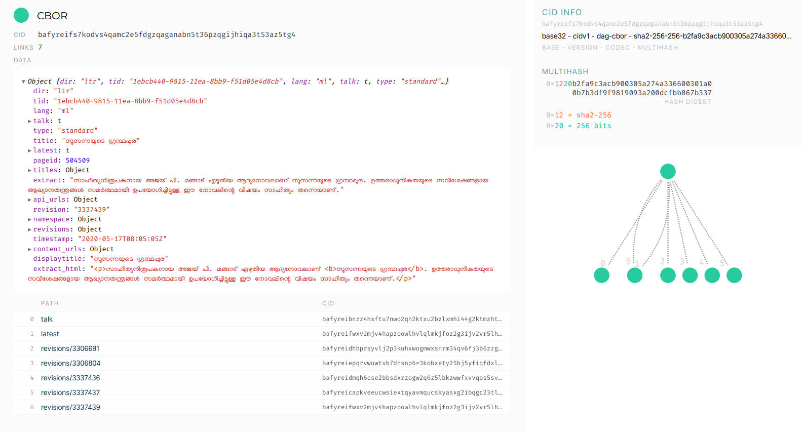
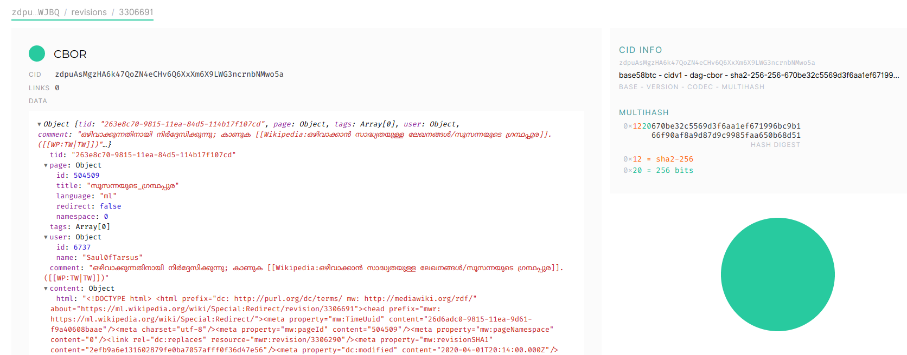
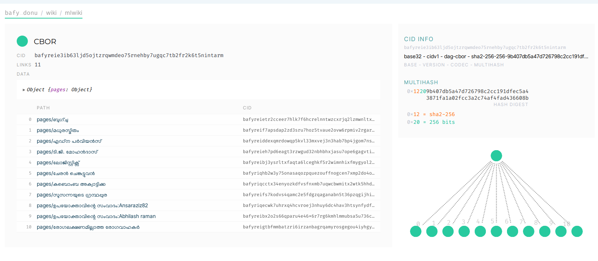
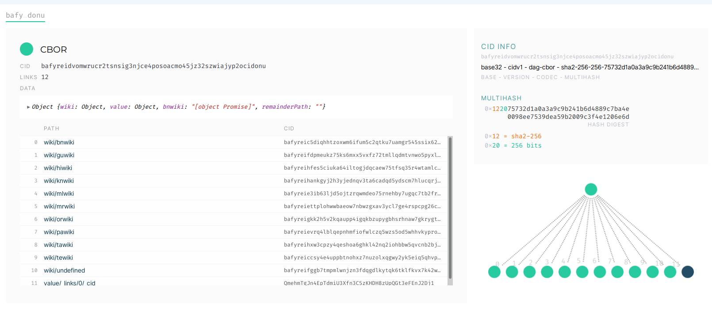

# Wikipedia-IPFS

An exploration to host Wikipedia in [IPFS][1]. This project contains code to extract content from wikipedia and add to IPFS and documentation of the proposed architecture. This is just a proof of concept and not ready for any serious use.

## Table of Contents

- [Wikipedia-IPFS](#wikipedia-ipfs)
  - [Table of Contents](#table-of-contents)
  - [Introduction](#introduction)
  - [Goals](#goals)
  - [Architecture](#architecture)
    - [Feeder](#feeder)
    - [Publisher](#publisher)
    - [Editor](#editor)
    - [Reader](#reader)
  - [Permanent address](#permanent-address)
  - [Search](#search)
  - [Beyond wikipedia](#beyond-wikipedia)
  - [What next](#what-next)
  - [Disclaimer](#disclaimer)

## Introduction

[IPFS][1] is a protocol for building decentralized web. Wikipedia is currently hosted in **its** servers. To decentralize the sum of all human knowledge, we need to host and maintain all such knowledge in a decentralized network. There are many candidates for such distributed web protocol. IPFS, [DAT][2] are some examples. None of them are highly popular among common internet users, but they are in more or less active development.

IPFS had [attempted][3] to host the Turkish wikipedia a few years back. It is based on static snapshot of wikipedia pages - basically static html files. If somebody update the hosted snapshot, users get that snapshot. But wikipedia is very dynamic. Thousands of edits happens every day. New articles are created every time. The pre-rendered HTML pages are not really a convenient representation of knowledge, at least it is not convenient for computing.

> If you are not already familiar with the concepts of decentralized web and IPFS, please have some background reading about them to better understand this document.

## Goals

1. **Every Wikipedia content revisions as objects in decentralized web. They are content addressable**:  This is basic units of content in wikipedia world. Each revision, once created, is immutable. There is no way you can change it. Each revision will have content associated with it and some metadata such as who create it and when.
2. **Every wikipedia article having an object in decentralized web with pointers to its revisions**: An article in wikipedia is editable. The latest revision represent the current state of the article. But one can always access its  old revisions at any point. It is desirable to have a human readable name along with IPFS hash id for each article.
3. **Every wikipedia having an object in decentralized web with addresses of its articles**: A wikipedia is a collection of articles(But not limited to). So a wikipedia like English Wikipedia is kind of a registry with listing of all its articles. (*In case you are wondering why I mention each wikipedia when there is a single wikipedia - You may not know this, but there are wikipedia in nearly 300 languages. English Wikipedia, Spanish Wikipedia, Tamil Wikipedia are examples*)
4. **A Wikipedia reading web application that can live in a decentralized web**: To make the content in decentralized web usable or consumable, we need a wikipedia reading and possibly editing interface. This application presents the content for human conception.

## Architecture

> In my previous attempt, I was trying to model everything using files and using "files" feature of IPFS. You may read that approach in README.old.md in this repo. After I published it, many people contacted and me to discuss these concepts. From all those discussions, I found that, it is better to model the content as Linked Data. It gives easier path towards semantic knowledge(a concept I am very much interested). So in this approach, I am using [IPLD][17] - Inter Planetory Linked Data.

The proposed architecture with four components - Feeder, Publisher, Editor, Reader. We will explain each of them in detail in this document.

### Feeder

> For detailed documentation, see [packages/feeder](packages/feeder)

This component adds content from current wikipedia to IPFS in massive scale. An implementation of this is available in this repository. See packages/feeder folder.

Based on the articles that were edited recently(using edit event stream), all available information about the article, its revisions are fetched from Wikipedia APIS. This structured information is then transformed to an IPFS DAG. In otherwords, we represent the JSON formatted API result into an IPLD - Inter Planetary Linked Data.

This package also provide ways to programmatically create article nodes based on any other lists or categories. This is a bridge between current wikipedia and IPLD.

When an article is added to IPLD, it publishes a message in PUBSUB with a topic. The message contains the CID of the article and its title. It does not add this article to any wikipedia in IPLD. Adding the article to wikipedia and tracking it using the CID is done using the Publisher component explained below.

The main reason behind this independent addition of articles to IPLD is because publishing and tracking need its own "authority control" or keys. Secondly, we need a lot of such feeder because there are too many edits happening in all of 300+ wikis to listen and add to IPLD. Since we are talking about distributed wikipedia, its components should also be truly distributed too, right? There is no need to worry about duplication in IPFS anyway since all are content addressed.

The following image shows a real article from Malayalam wikipedia published. It has 4 revisions and revisions point to another nodes. The `latest`  points to latest revision.

You may explore this node using IPLD explorer. https://explore.ipld.io/#/explore/bafyreifs7kodvs4qamc2e5fdgzqaganabn5t36pzqgijhiqa3t53az5tg4

A revision node will look like the below image. You can access it using the IPLD explorer link: https://explore.ipld.io/#/explore/zdpuAxU6hAxiU47Ga9HU6ok1vKztVagns5AxurAJMnVJEWJBQ/revisions/3306691

### Publisher

> For detailed documentation, see [packages/publisher](packages/publisher)

This component keep track of articles in a wikipedia. Publisher publishes a tracker to IPLD for every wikipedia. It has titles as key and CID of article. The entries in this tracker is collected by subscribing the article create/edit messages published by Feeder(also [Editor](#editor) as explained below). Once an article CID changes, the CID of that wikipedia also changes. Knowing the latest CID of a particular wikipedia is important to access latest article in that wikipedia.

For this, Publisher publishes the CID and wikiname to IPFS PUBSUB.

But there are many wikis. We need a tracker for tracking all these wikis. So publisher maintains a Wikipedia tracker. It contains wikipedia name and its latest CID.

Since CIDs keep changed for every edit, for a human to access the stable name is required, also known as IPNS. The publisher program tries to update the IPNS to point to the latest CID. Currently this is not an accurate process since IPNS updating is a very slow process. As IPFS improves the IPNS performance, our program will be more accurate.

But, to overcome the difficulties of slow IPNS, the publisher program broadcasts the latest CID in a IPFS PUBSUB topic 'wikipedia/cid'.

How many such publishers are required? We can have any number of publishers, but only one publisher can have the key to publish the IPNS of the wikipedia IPLD universe. If another publisher create IPNS from CID, that will be different.

The publisher can also do some more "editorial" roles such as authenticating the article publish messages with a user's certificate or key(depends how we design it). It can do some validation on article IPLD based on a schema or validation rules. It can have spam detection and so on. Theoretically this opens up a possibility of multiple Wikipedias existing in IPLD with different editorial policies. This is an interesting outcome, I have not fully thought about the implications.

### Editor

Wikipedia is editable. Editing an article in IPLD and publishing new revision is possible. This is similar to what we did in [Feeder](#feeder). The editor can be anything as long as it create a new valid article IPLD. New CID of this article is then published in IPFS PUBSUB. Somewhere, a publisher will pick this up and decide to add to the wikipedia tracker. Ideally, the editor will be part of a [reader](#reader) application

Will that edit get reflected in non-distributed wikipedia? I don't know.

### Reader

A reader application resolve the IPNS of Wikipedia IPLD to get current CID or/and subscribe to the IPFS PUBSUB to get latest CID. Then get the content of the article by traversing to wikis tracker and then to the article tracker. Get latest CID of the article and render to a user.

This application should also be hosted in IPFS or available locally in users devices.

In the past, I(Santhosh) had attempted to build a static web application that can be hosted in distributed web. I have placed this application in IPFS. See https://bafybeibgkplzawivq3w3evxj6uxy2e4uckgy3skyxicll7rxnrpuz6okn4.ipfs.dweb.link/

`bafybeibgkplzawivq3w3evxj6uxy2e4uckgy3skyxicll7rxnrpuz6okn4` is base32 encoded form of `QmQvGMPfub4HwD5BxuPQ95skHENw36wrkJisYMQWkgqdkJ`. Alteratively this application can be run from desktop or mobile(it is a Progressive web app). Anyway, some work is required in this front, but there is a proof of concept. It currently uses the wikipedia REST API and need to rewire to take content from decentralized web.

## Permanent address

If every edit change the CID or hash of wiki, how do we refer it in a permanent way? IPFS provides a way for this - It is name IPNS(Inter Planetory Naming System)

"Inter-Planetary Name System (IPNS) is a system for creating and updating mutable links to IPFS content. Since objects in IPFS are content-addressed, their address changes every time their content does. That’s useful for a variety of things, but it makes it hard to get the latest version of something. A name in IPNS is the hash of a public key. It is associated with a record containing information about the hash it links to that is signed by the corresponding private key. New records can be signed and published at any time."

So every wikipedia, in addition to its `ipfs/CID` address, there will be an IPNS address like `/ipns/QwxoosidSOKWms..`. If that is not readable [DNSLink][6] comes handy and we can have addresses like `/ipns/en.wikipedia.org`.

## Search

The IPLD based representation of knowledge is usable only if people can easily search in the content. The search is not just about keywords, but semantic querying like we do using [SPARQL][18]. In this exploration, the data in IPLD is not strictly based on any RDF. But it can be. If we can represent the data in RDF, can we have a SPARQL implementation for IPLD?

## Beyond wikipedia

While working on this exploration and studing IPLD and [multihash and multiformats][19], I started thinking about linking all non-wikipedia knowledge structures also part of this IPLD. IPLD allows linking to independent IPLDs existing in IPFS - They an be any IPLD formats such as Git. Also, if there are educational and knowledge resources exist in IPLD, it is quire trivial to link them to article IPLD. I talked about wikipedia and articles in this exploration, but wikidata information associated with each article can be easily linked to article IPLD.

## What next

Wikipedia is big. The concepts I explained in content architecture address only a subset of the content. There are users, non-article content. There are interactive(JS based) content. There are talk pages and so on. We need a content architecture to accommodate all of them. If we are able to map every REST API output of wikipedia to corresponding data source in IPFS, building a reading application is more close.

There are so many problems to solve: The content has links that need to be rewritten. The images need to be stored and addressed. I don't know how to implement a powerful search in IPFS content. More importantly, how to edit this content? resolve conflicts? They are not impossible anyway.

Wikipedia users share the sum of free knowledge. They create the content collaboratively and share it. Can they share the infrastructure also? If reading a wikipedia page means having a copy of the content in the node in a decentralized web, I think it will be faster and cheaper to run wikipedia.

## Disclaimer

> Even though the author is an Engineer at Wikimedia foundation, this is not an official Wikimedia foundation project.

[1]: https://ipfs.io/
[2]: https://datproject.org
[3]: https://ipfs.io/blog/24-uncensorable-wikipedia/
[4]: https://beakerbrowser.com/
[5]: https://docs.ipfs.io/guides/concepts/ipns/
[6]: https://docs.ipfs.io/guides/concepts/dnslink/
[7]: https://wikipedia.thottingal.in
[8]: https://wikipedia.hashbase.io
[9]: https://wikitech.wikimedia.org/wiki/Event_Platform/EventStreams
[10]: https://js.ipfs.io/
[11]: https://github.com/ipfs/go-ipfs
[12]: https://docs-beta.ipfs.io/reference/http/api/#getting-started
[13]: https://github.com/ipfs/js-ipfs/tree/master/packages/ipfs-http-client
[14]: https://ml.wikipedia.org/wiki/രവി_വള്ളത്തോൾ
[15]: https://github.com/ipfs-shipyard/ipfs-companion
[16]: https://www.publish0x.com/ecosystem-overviews-and-analysis/the-precarious-state-of-ipfs-in-the-year-2020-xmvxeg
[17]: https://ipld.io/
[18]: https://en.wikipedia.org/wiki/SPARQL
[19]: multiformats.io